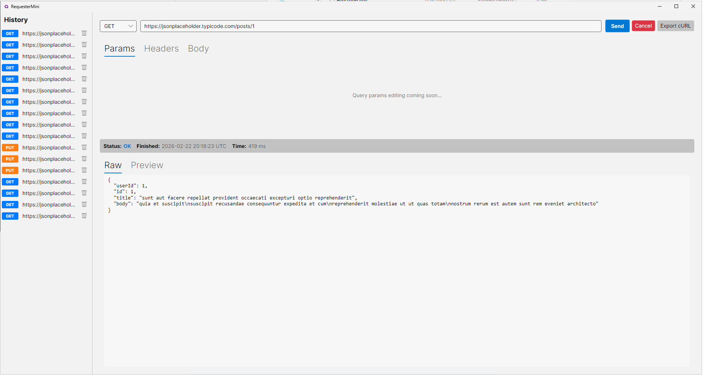

# RequesterMini

Avalonia Base Http request Maker

Two front ends share the same libraries:

- **`src/RequesterMini`** — the Avalonia desktop app.
- **`src/RequesterMini.Web`** — a Blazor Server app with a MudBlazor UI, same features in a browser.

## Web app (Blazor Server + MudBlazor)

```bash
dotnet run --project src/RequesterMini.Web
```

Then open the printed URL (`http://localhost:5168` with the `http` profile). It offers the same
request builder as the desktop app — methods, body types with live JSON validation, headers, query
params mirrored into the URL, Basic auth, cURL export, `.bru` import — plus a syntax-highlighted
response view and a persisted request history at `/history`.

`GET /healthz` is a liveness endpoint for container orchestrators.

### Docker

The build context is the repository root, because the web app references sibling libraries:

```bash
docker build -f src/RequesterMini.Web/Dockerfile -t requestermini-web .
```

```bash
docker run -p 8080:8080 -v requestermini-data:/data requestermini-web
```

Or with Compose:

```bash
docker compose up --build
```

History and logs are written to `/data` (override with the `DataDirectory` environment variable), so
mount a volume there to keep them across restarts. The container serves plain HTTP on `8080` and
honours `X-Forwarded-*`, so put it behind a reverse proxy that terminates TLS. Blazor Server keeps
per-user state in the circuit, so run a single replica unless the proxy does sticky sessions.

> The app sends HTTP requests on the user's behalf from wherever it runs. Deployed on a public host
> that makes it a general-purpose proxy into that network — keep it behind authentication.

## Generate Executable (for Smelly nerds)

> Single-file + trimmed build is configured in the project. Just run the publish command.

### Windows Publish
```bash
dotnet publish -r win-x64 --self-contained true -c Release
```

### macOS Publish
```zsh
dotnet publish -r osx-arm64 --self-contained true -c Release
```

### Distribution

The following native files must be distributed **alongside** the exe:

| File | Purpose |
|---|---|
| `av_libglesv2.dll` | Avalonia GPU/OpenGL rendering |
| `libHarfBuzzSharp.dll` | Font shaping |
| `libSkiaSharp.dll` | Skia graphics engine |

## Used Prompts
- [For Styling](https://chat.openai.com/share/56bad6c9-9997-4f55-96d1-5b7714ede4be).

## Screenshot

The following screenshot shows the main UI of RequesterMini.



